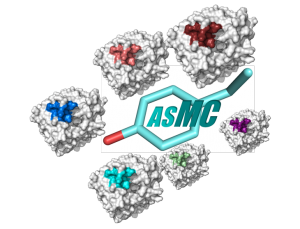
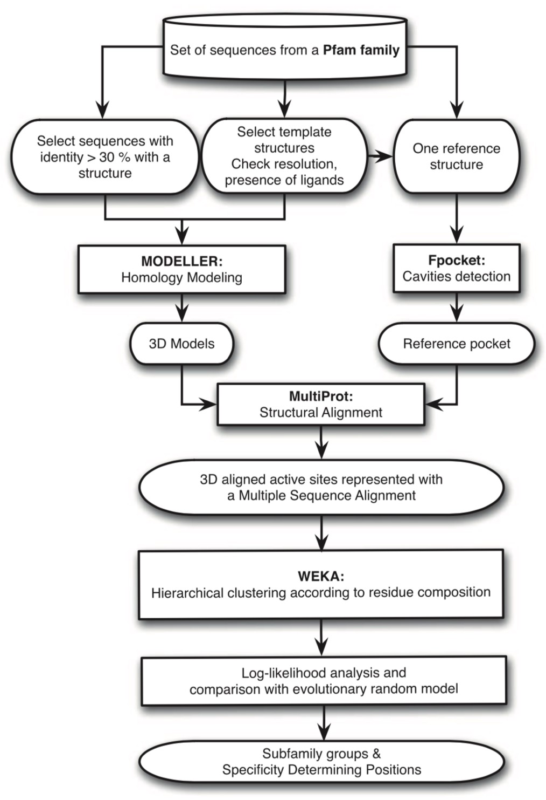

<!--  -->
<!-- center and resize the image with html syntax -->
<p align="center">
  
</p>

# ASMC: Active Site Modeling and Clustering

ASMC code from de Melo-Minardi et al. (2010) (see section References), updated in 2016.

ASMC is an unsupervised method to classify sequences using structural information of homologous protein pockets. The different steps are described hereafter.

<!--  -->
<!-- center and resize the image with html syntax -->
<p align="center">
  
</p>

# Installation

## Manual Installation

ASMC can only be cloned/downloaded from GitHub.
```
git clone https://github.com/labgem/asmc_2016
```

Besides this repository, ASMC requires these five softwares (original versions are listed, later versions have not been tested):
- `Modeller v9.18` - (upon request) <https://salilab.org/modeller/download_installation.html>
- `Fpocket v2.0` - <https://github.com/Discngine/fpocket>
- `MultiProt v1.5` - (upon request) <http://bioinfo3d.cs.tau.ac.il/MultiProt/>
- `Weka v3.4.13` - <https://waikato.github.io/weka-wiki/downloading_weka/>
- `WebLogo v3.0` - <https://github.com/WebLogo/weblogo>

The following features are also required:
```
Python 2.7
Biopython 1.77
CoreBio 0.5.0
Java 8 (or later)
R 4.0.0
Ape (R library)
Pixmap (R library)
```

## Modeller installation

1. download Modeller within the asmc_2016 repository `<path_to_repository>/asmc_2016`.
2. move *modpy.sh* to `<path_to_repository>/asmc_2016/src` - this script belongs to the Modeller package.
2. add/check the Modeller path within *modpy.sh* (line 3: `TOPDIR=`).
3. write the Modeller Python path within *fit_model.py* (line 15: `sys.path.append('')`).

# Usage

ASMC includes two main scripts that can be run independently: *run_modeller.sh* and *run_asmc.sh*.

## Homology modeling (*run_modeller.sh*)

Builds homology models of interesting sequences (targets) based on one or several existing structures (templates) using Modeller software.

### Inputs

The following files MUST be created in the folder from where you run the script:
- `targets.txt`: listing all fasta sequences ID(s) used as “targets”.
- `<pdbID>.pdb`: one PDB file per template.
- `templates.txt`: listing PDBs ID + chain used as “templates” - PDB ID and chain must be separated by a tabulation, e.g: `6IAU  A`.
- `<seqID>.fasta`: one FASTA file per sequence to model - FASTA file name MUST match the sequence header.

### Run
```bash
./run_modeller.sh REPERTORY PERC_identity
```
- `REPERTORY`: the one in which inputs are located.
- `PERC_identity`: sequence identity threshold (%), between targets and template(s), to build a model.

## Structural alignment and hierarchical classification (*run_asmc.sh*)

Performs the following steps:
-	3D pocket detection in a reference protein using Fpocket software.
-	detection of this reference pocket in all 3D models.
-	structural alignment of pockets using Multiprot software.
-	detection of highly conserved positions (CPs).
-	conceptual clustering approach to discriminate subfamilies (COBWEB algorithm included in WEKA software).
-	detection of specificity-determining positions (SDPs).

### Inputs

The following files MUST be created in the folder from where you run the script:
- `models.txt`: listing all PDB models ID with the extension .pdb.
- `<pdbID>.pdb`: one PDB file per template and per model.
- `templates.txt`: listing PDBs ID + chain used as “templates” - PDB ID and chain must be separated by a tabulation, e.g: `6IAU  A`.

### Run
```bash
./run_asmc.sh -d DIR -models FILENAME -pdbref PDBFILE -chain CHAIN_ID -pockets N
```
- `-d DIR`: working directory to store results (default ./).
- `-models FILENAME`: list of homology models files (PDB format).
- `-pdbref PDBFILE`: PDB file used as a reference structure. The best reference structure is the one with a ligand inside the active site. Otherwise, pick up the structure with the best resolution, with no loops, side-chains or fragments missing. If you want ASMC to pick up the best reference structure for you, use option `-pdbref pick`.
- `-chain CHAIN_ID`: chain for the reference structure. If you want ASMC to pick up the best reference structure for you, use option `-chain pick`
- `-pockets N`: number of pockets, from 1 to N, you want Fpocket to find. Fpocket ranks detected cavities from the biggest to the smallest one. Generally, the active pocket corresponds to the biggest one or the more conserved one (see Fpocket manual for more information). User should check that the pocket corresponds to the active site.

### Examples

You chose `TEST.pdb` as the reference structure (chain B) and you want Fpocket to find up to 5 pockets in the reference structure. All generated 3D models (cf. Homology modeling) are listed in the file `models.txt`.
- **Case 1**: automatic selection of reference structure and automatic search of pockets
```bash
./run_asmc.sh -d ./ -models models.txt -pdbref pick -chain pick -pockets 5
```
- **Case 2**: automatic search of pockets.
```bash
./run_asmc.sh -d ./ -models models.txt -pdbref TEST.pdb -chain B -pockets 5
```
- **Case 3**: you provide a pocket in a file called `list_aa_pocket.dat` where you list the amino acids from the reference structure you want to see in other models. This file MUST be in the folder from where you launch ASMC. This version won´t allow you to use the option `-pdbref pick`.
```bash
./run_asmc_def.sh -d ./ -models models.txt -pdbref TEST.pdb -chain B -pockets 1
```

# References

## ASMC publication

de Melo-Minardi RC, Bastard K, Artiguenave F., Identification of subfamily-specific sites based on active sites modeling and clustering, Bioinformatics (Oxford, England) 26(24), 3075-3082 (2010). <https://doi.org/10.1093/bioinformatics/btq595>

## ASMC applications

Bastard, K., Smith, A., Vergne-Vaxelaire, C. et al. Revealing the hidden functional diversity of an enzyme family. Nat Chem Biol 10, 42–49 (2014). <https://doi.org/10.1038/nchembio.1387>

Mayol, O., Bastard, K., Beloti, L. et al. A family of native amine dehydrogenases for the asymmetric reductive amination of ketones. Nat Catal 2, 324–333 (2019). <https://doi.org/10.1038/s41929-019-0249-z>

Bastard, K., Perret, A., Mariage, A. et al. Parallel evolution of non-homologous isofunctional enzymes in methionine biosynthesis. Nat Chem Biol 13, 858–866 (2017). <https://doi.org/10.1038/nchembio.2397>
